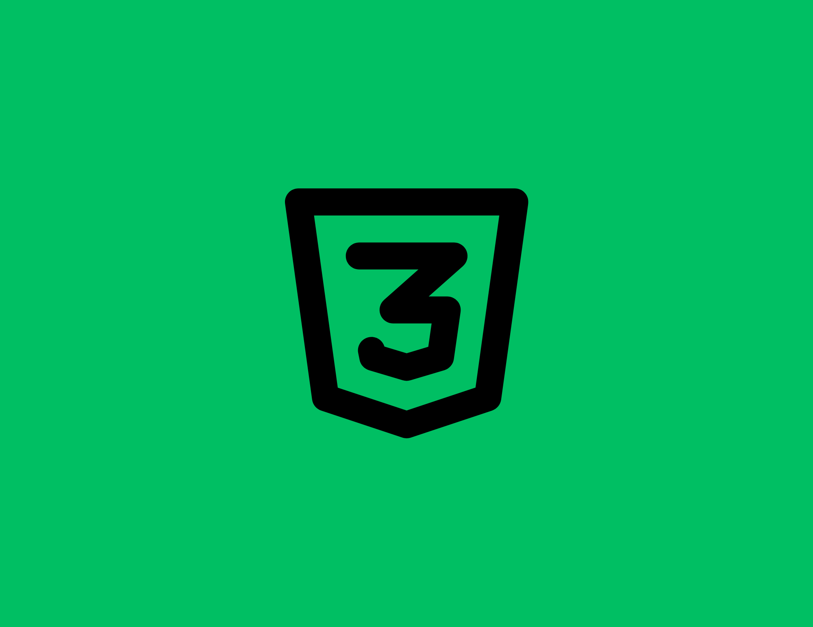
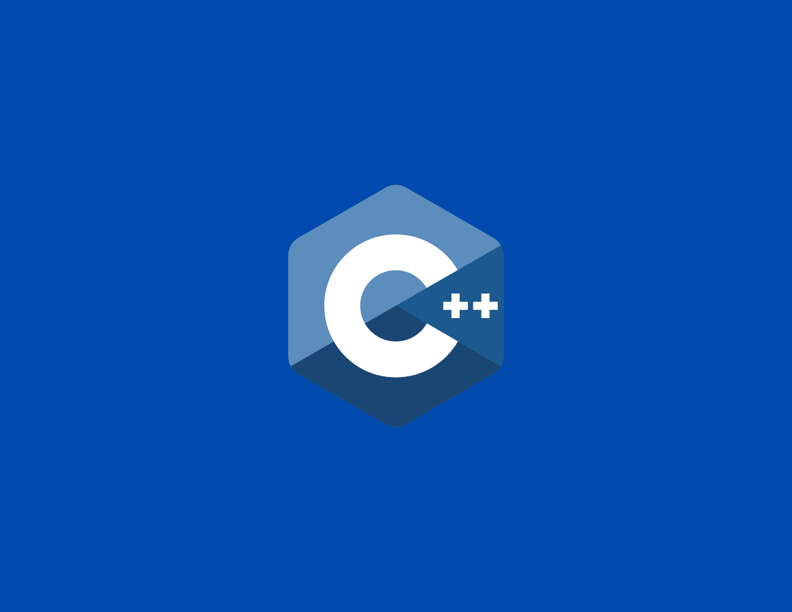
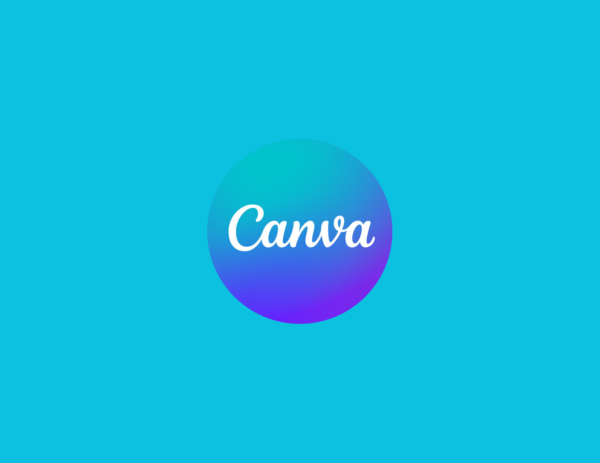
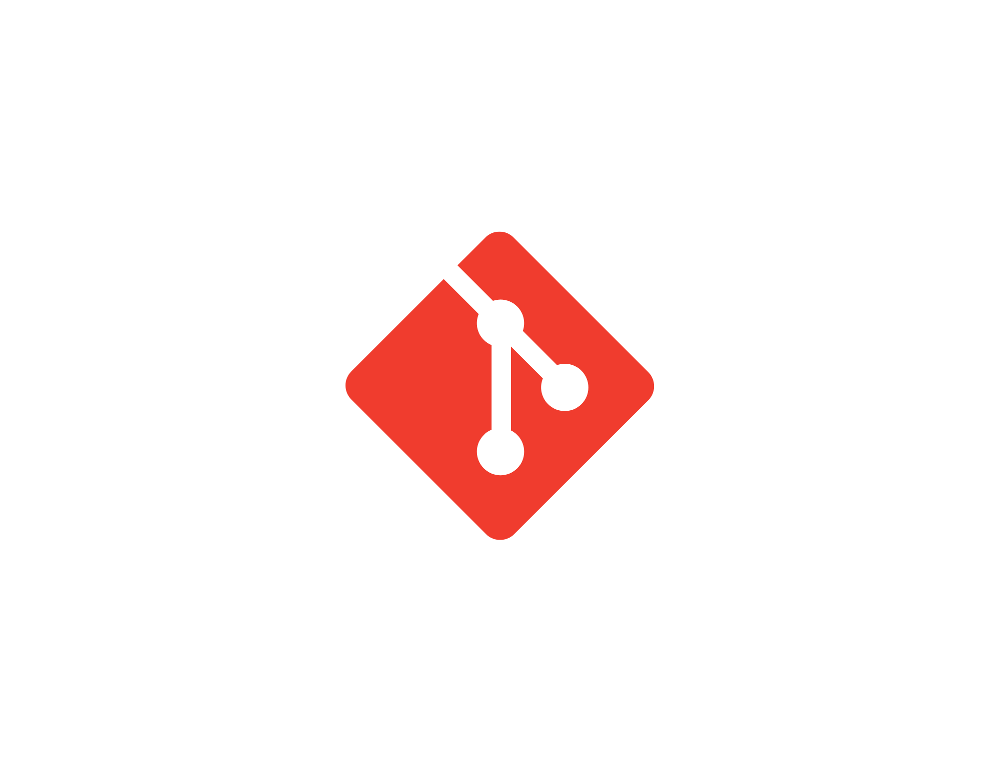
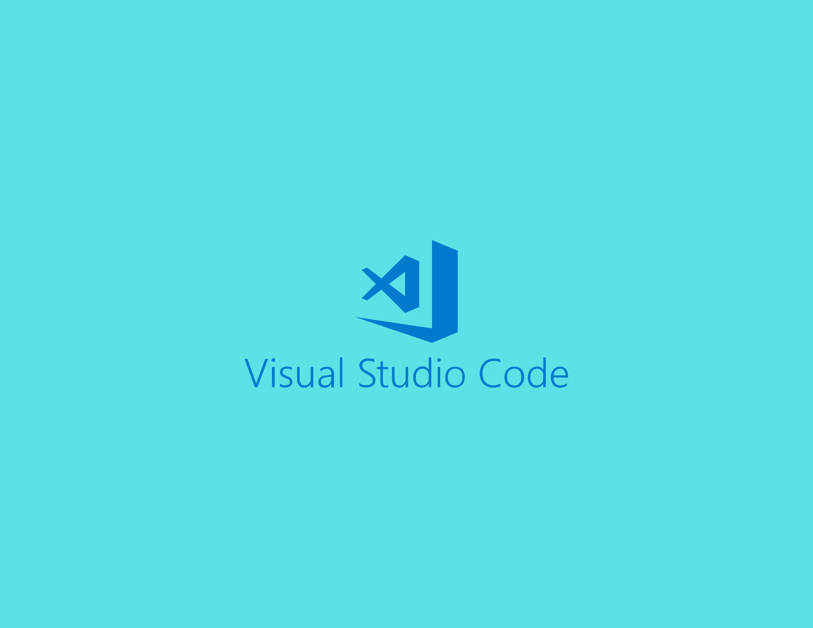

<h1 align="center"> Bienvenue 👋</h1>

Computer Engineer Student

  <h2 style="color: rgb(22, 150, 0)">Compétences Tech 💻</h2>
  

    
    
    
    
    
    
    
    
    
    
  

Contactez moi

  
  

